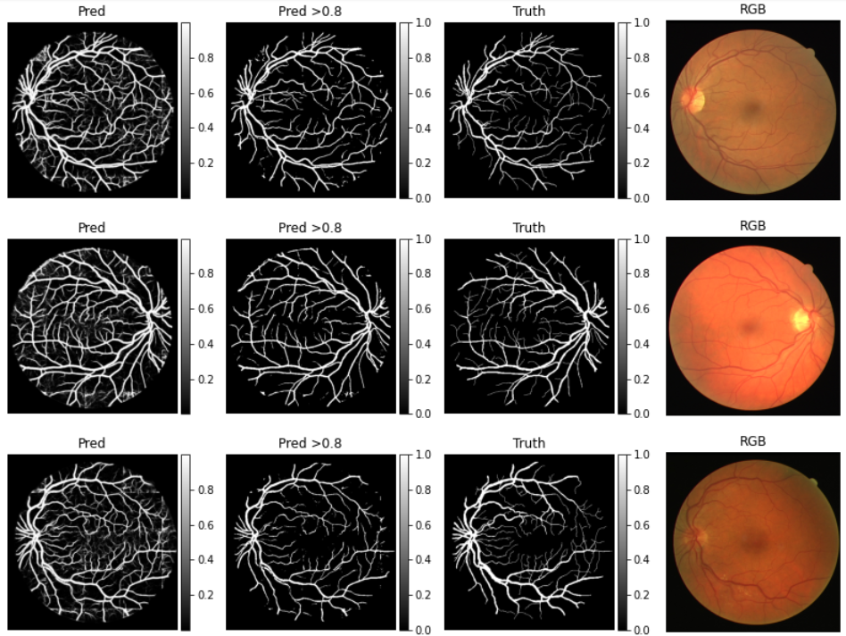
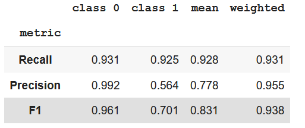
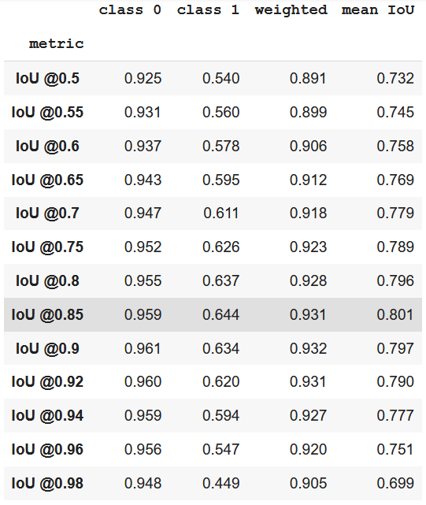

<h2> Blood vessel segmentation with custom U-Net model</h2>

Main goal of this lab assignment is to train a binary segmentation model that separates blood
 vessels from other parts of inner eye in a retinal image

Our tasks:

<ol>
<li>Unifying data from <a href="http://www.isi.uu.nl/Research/Databases/DRIVE/">DRIVE</a>, <a href="https://cecas.clemson.edu/~ahoover/stare/">STARE</a> and <a href="http://www5.cs.fau.de/research/data/fundus-images/">HRF</a> datasets. Splitting it into train and test sets.</li>
<li>Crop every RGB image and corresponding vessels mask into multiple patches of 128x128px size.</li>
<li>Generate train/val datasets based on tf.data api.</li>
<li>Make a model for image segmentation based on U-NET architecture.</li>
<li>Train the model.</li>
<li>Analyze the results using test dataset.</li>
</ol>

<table>
  <tr>
        <th width="800px" style="text-align:center">Fig 1. Prediction results of the trained model 
		('Pred' - prediction, 'Pred >0.8' - prediction with threshold of 0.8,
		'Truth' - the true values, 'RGB' - real image of the inner eye)</th>
  </tr>
  <tr>
    <td align="center">
        
    </td>
  </tr>
</table>

<table>
  <tr>
        <th width="800px" style="text-align:center">Fig 2. Main metrics' scores on 
		test data of the <a href="http://www.isi.uu.nl/Research/Databases/DRIVE/">DRIVE dataset</a> 
		('class 0' - background, 'class 1' - blood vessels</th>
  </tr>
  <tr>
    <td align="center">
        
    </td>
  </tr>
</table>

<table>
  <tr>
        <th width="800px" style="text-align:center">Fig 3. IoU metric scores on 
		test data of the <a href="http://www.isi.uu.nl/Research/Databases/DRIVE/">DRIVE dataset</a>
		('class 0' - background, 'class 1' - blood vessels</th>
  </tr>
  <tr>
    <td align="center">
        
    </td>
  </tr>
</table>
