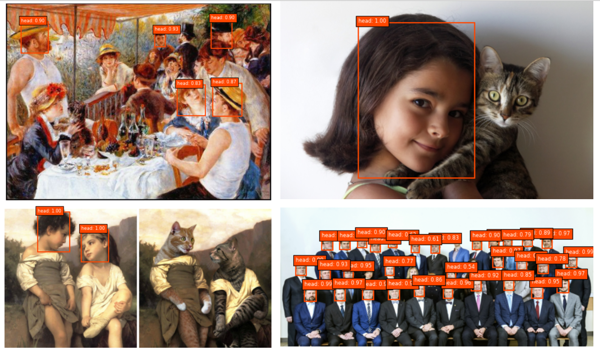

<h1>Human head detection using [Single Shot Multibox Detector (SSD)](https://github.com/AVAuco/ssd_head_keras)</h1>
Simple introductory laboratory assignment meant to get familiar with Google Colab notebooks, their interaction with Google Drive storage, and pretrained object detection algorithm. 

