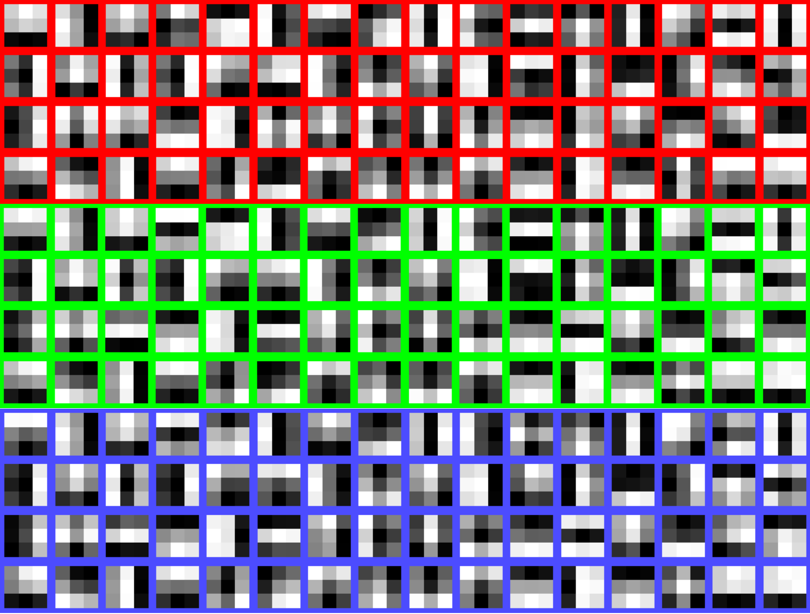
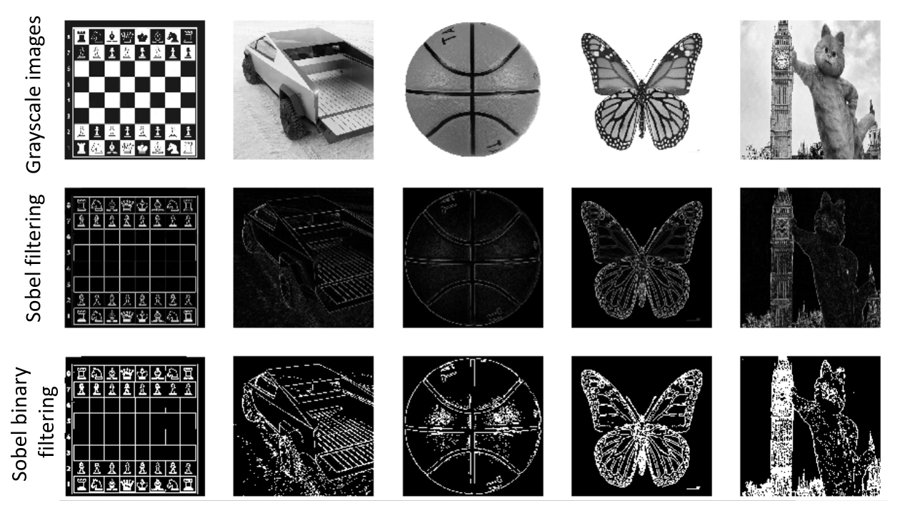

<h2>Analysis of kernel weights in the first Conv2D layer of SSD Head detection model</h2>

Main goal of this lab assignment is to check the hypothesis that the first convolutional layer in an object detection model performs edge detection among other feature extraction tasks.

Our tasks:
1. Analyze learned kernel weights of the first convolutional layer in the SSD head detection model. Carry on a convolution operation on an example image using the retrieved kernel weights sand analyze the results.
2. Run a simple edge detection model based on Sobel filter using TensorFlow functional API. Test it on few example images to see the basics of edge detection.

<table>
  <tr>
        <th>Fig 1</th>
        <th>Fig 2</th>
  </tr>
  <tr>
    <td>
        
    </td>
    <td>
        
    </td>
  </tr>
</table>
